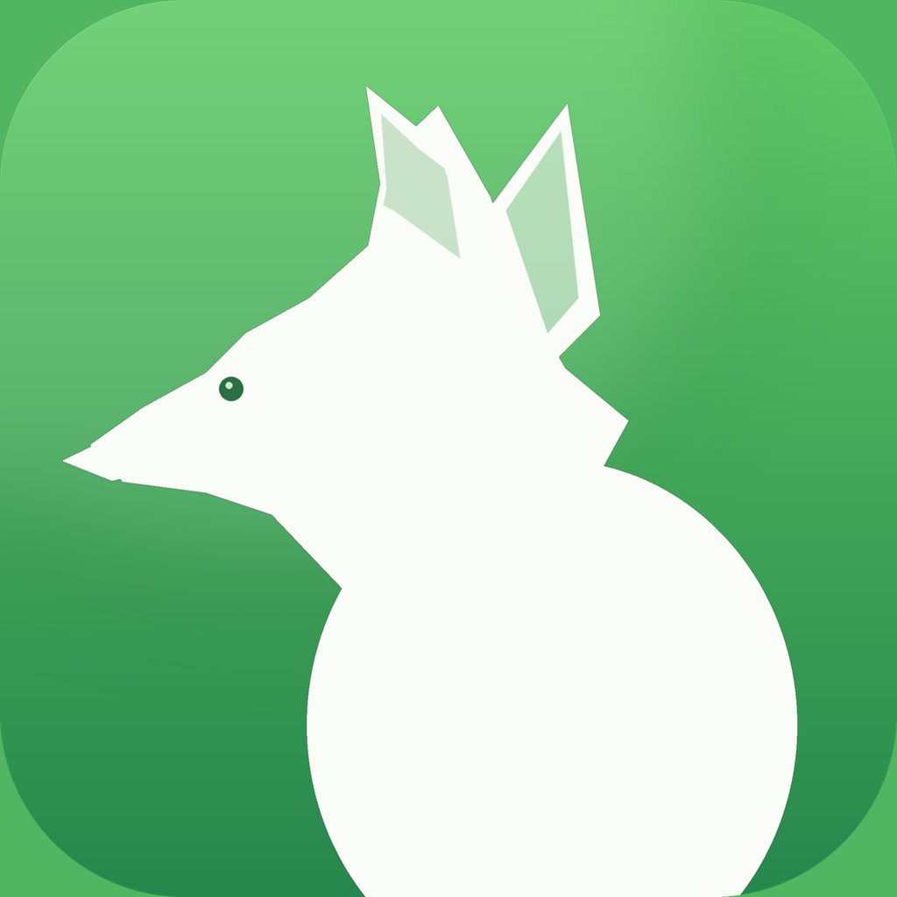

<picture>
  <source media="(prefers-color-scheme: dark)" srcset="browser/Reynard/Resources/Assets.xcassets/AppIcon.appiconset/icon-dark.png">
  
</picture>

# BaklaFox 🦊

**A Gecko browser for older iPhones, TrollStore, and jailbreak users.**

BaklaFox is a fork of [Reynard Browser](https://github.com/minh-ton/reynard-browser) that replaces WebKit with **Gecko**, the same engine used by Firefox. This gives older iPhones a more capable browser for modern websites when Safari can no longer keep up.

The project is built specifically for **iOS 13 and 14**, with dedicated support for **TrollStore** and **jailbroken devices**. It also includes extensive crash fixes, compatibility patches, and stability improvements over the original Reynard release.

## Downloads

Grab the latest build from the [Releases page](https://github.com/BaklaLabs/BaklaFox/releases).

| Package | For |
|:--|:--|
| `BaklaFox-TrollStore.tipa` | TrollStore (JIT included) |
| `BaklaFox-Jailbroken.ipa` | Jailbroken devices with AppSync Unified |
| `BaklaFox.ipa` | AltStore, SideStore, or similar |

## Installation

### TrollStore
1. Download `BaklaFox-TrollStore.tipa`
2. Open in TrollStore → Install
3. JIT works automatically

### Jailbroken
1. Download `BaklaFox-Jailbroken.ipa`
2. Install via Filza + AppSync Unified
3. Use **Choicy** to disable tweak injection if Gecko gets unstable (tweaks can crash it)

Tested on Taurine (iOS 14). Other jailbreaks may behave differently.

### AltStore / SideStore
1. Download `BaklaFox.ipa`
2. Sideload normally
3. Enable JIT through your signing setup

## Compatibility

- **iOS 13+** primary focus is 13 and 14
- Tested on: iPhone SE (2016), iOS 14.4.2, Taurine
- TrollStore, jailbreak, AltStore all work
- First launch is slow while Gecko sets up its profile that's normal
- This is experimental! Some sites, extensions, or setups may still break

## What's different from Reynard

Beyond a rename and new icons, BaklaFox has a bunch of fixes aimed at stability on older iOS:

| Area | What changed |
|:--|:--|
| **App data** | `MOZ_APP_DATA` paths now work on iOS 14 TrollStore |
| **Startup** | Earlier logging, safer directory setup, graceful failure handling |
| **Gecko helper** | Forces the right helper extension was launching the wrong one before |
| **JIT** | Works with TrollStore, jailbreak entitlements, and paired devices |
| **Add-ons** | UI updates now happen on the main thread no more immediate crashes |
| **Storage** | Bookmarks, history, downloads etc. won't crash if a directory is missing |
| **Audio/video** | Fixed for iOS 13 and 14 video was broken on legacy iOS |
| **Jailbreak** | Fewer crashes from sandbox differences and tweak injection |

## Building from source

### Requirements
- macOS + Xcode 16+
- Homebrew + `ldid`
- Enough disk space for Gecko (~15 GB free)

```bash
# Install tools
brew install ldid

# Clone + submodules
git clone --recursive https://github.com/BaklaLabs/BaklaFox.git
cd BaklaFox

# Download & patch Gecko (Firefox engine)
tools/development/update-gecko.sh
tools/development/apply-patches.sh

# Build JIT library & Gecko
tools/development/build-idevice.sh
tools/development/build-gecko.sh

# Build app & create packages
tools/release/build-app.sh
tools/release/create-ipa.sh
```

Output lands in `dist/`:

```
BaklaFox.ipa
BaklaFox-TrollStore.tipa
BaklaFox-Jailbroken.ipa
```

After the first full build, app-only changes only need:

```bash
tools/release/build-app.sh
tools/release/create-ipa.sh
```

## Credits

BaklaFox is based on [Reynard Browser](https://github.com/minh-ton/reynard-browser) by [Minh Ton](https://github.com/minh-ton).

App code: GPLv3 · Gecko patches: MPL 2.0

---

<p align="center">🦊 Made with love at <strong>BaklaLabs</strong></p>
